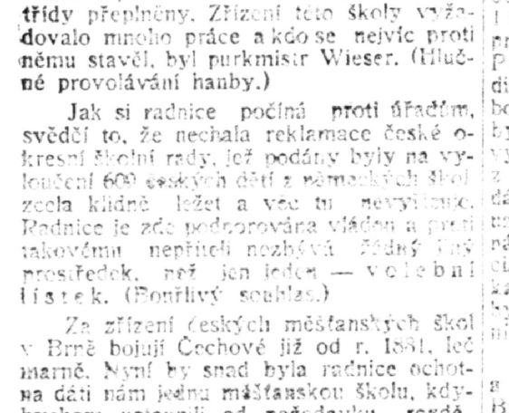
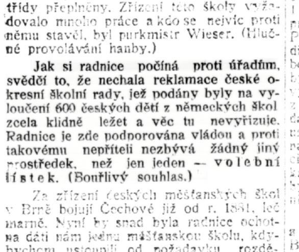

# pero-enhance

Tool for text-guided textual document scan quality enhancement. The method works on lines of text that can be input through a PAGE XML or detected automatically by a buil-in OCR. By using text input along with the image, the results can be correctly readable even with parts of the original text missing or severly degraded in the source image. The tool includes functionality for cropping the text lines, processing them with our provided  models for either text enhancement and inpainting, and for blending the enhanced text lines back into the source document image. We currently provide models for OCR and enhancement of czech newspapers optimized for low-quality scans from micro-films.

This package can be used as a standalone commandline tool to process document pages in bulk. Alternatively, the package provides a python class that can be integrated in third-party software.

 

The method is based on Generative Adversarial Neural Networks (GAN) that are trained on pairs of good quality and bad quality text document examples. The architecture includes convolutional encoder and decoder for repairing the visual quality of the text line image and transformer module with attention mechanism that aligns input text string to the image to provide more information for the decoder.

## Installation
The module requires python 3 and CUDA capable GPU.

Clone the repository (which clones pero-ocr as submodule) and add the pero_enhance and pero_ocr package to your `PYTHONPATH`:
```
clone --recursive https://github.com/DCGM/pero-enhance.git
cd pero-enhance
export PYTHONPATH=/abs/path/to/repo/pero-enhance:/abs/path/to/repo/pero-enhance/pero-ocr:$PYTHONPATH
```
Install other dependencies:
```
pip install -r requirements.txt
```
Before processing a document, you need to download configuration and pre-trained models needed for enhancement and OCR: 
```
python ./model/download_models.py
```
By default, models for czech newspapers are downloaded. Other models can be found in the table below. The list will be updated as we prepare more models.

## Usage
### Demo
Images in a folder can be enhanced by running following:
```
python repair_page.py -i ../example/ -x ../example/ -o /path/to/outputs
```
The above command runs OCR, stores the OCR output in ./example/, and stores the enhance images in /path/to/outputs. The generated OCR Page XML files can be manualy revised if the OCR quality is not satisfactory, and the command can be repeated to use these changes for better image enhancement.

Alternatively, you can run interactive demo by running the following, where the xml file is optional:
```
python demo.py -i ../example/82f4ac84-6f1e-43ba-b1d5-e2b28d69508d.jpg -x ../example/82f4ac84-6f1e-43ba-b1d5-e2b28d69508d.xml
```
When Page XML file is not provided, automatic text detection and OCR is done using `PageParser` from the pero-ocr package. 

The commands use by default models and settings optimized for czech newspapers downloaded during instalation. The models can be changed Different models for enhancement can be specified by `-r /path/to/enhancement-model/repair_engine.json` and OCR models by `-p /path/to/ocr-model/config.ini`. 

### EngineRepairCNN class
In your code, you can directly use the EngineRepairCNN class to enhance individual text line images normalized to height of 32 pixels or of whole page images when the content is  defined by pero.layout class. The processed images should have three channels represented as numpy arrays.
```
import repair_engine
enhancer = repair_engine.EngineRepairCNN(path/to/repair_engine.json)

enhanced_textline_image = enhancer.repair_line(textline_image, transcription_string)

inpainted_textline_image = enhancer.inpaint_line(textline_image, transcription_string)

from pero_ocr.document_ocr import layout
page_layout = layout.PageLayout(file="Path/to/page_xml/file")
enhanced_page_image = enhancer.enhance_page(page_img, page_layout)
```
The method enhancer.repair_line improves readability of the text line. The method enhancer.inpaint_line is able to change or inpaint missing text in the textline, and it expects the according part of the textline image to be blacked-out (pixels set to 0).

## Models

 | OCR Model | Enhancement Model | Target data |
 | --- | --- | --- |
 | [ocr_LN_2019-12-18.zip](http://www.fit.vutbr.cz/~ihradis/pero-models/ocr_LN_2019-12-18.zip) | [enhance_LN_2019-12-18.zip](http://www.fit.vutbr.cz/~ihradis/pero-models/enhance_LN_2019-12-18.zip) | Czech newspaper digitized from micro-films |
 | More to come | | |
